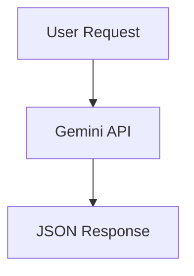

# Above-The-Fray
Simulation evaluation decision making software game

## Overview
Above-The-Fray is an interactive simulation and decision-making game platform built with JavaScript, HTML, and SQL.

## Tech Stack
* **Frontend:** HTML, CSS, JavaScript
* **Backend & Logic:** Node.js / JavaScript scripts
* **Database:** SQL

## How to Run
1. Clone the repository: `git clone https://github.com/72tefarie-art/Above-The-Fray.git`
2. Open `index.html` in your browser or run the JavaScript entry point file.

