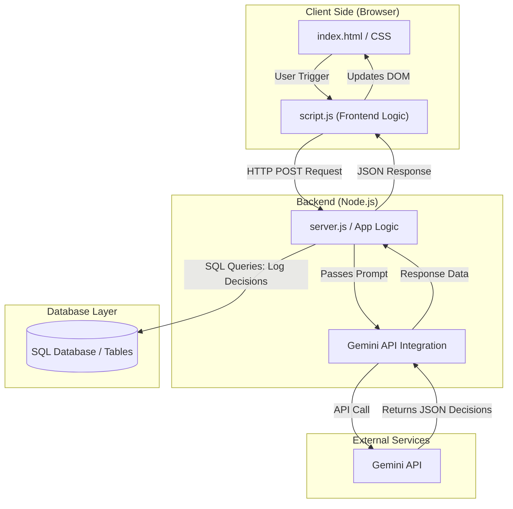
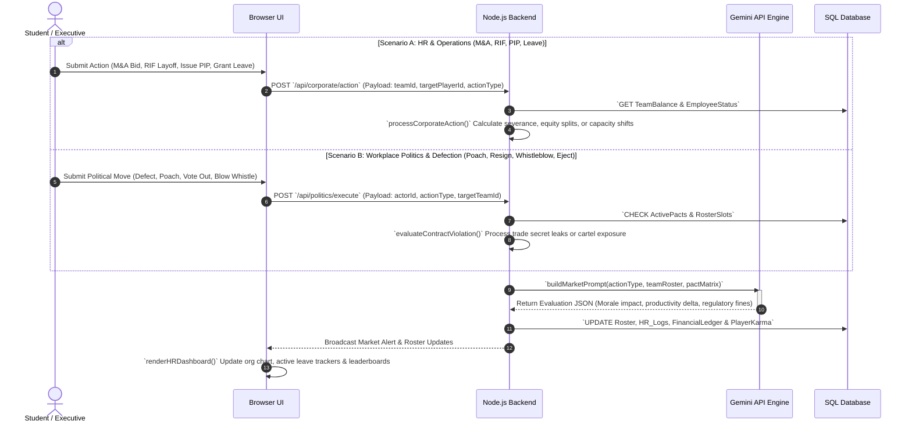
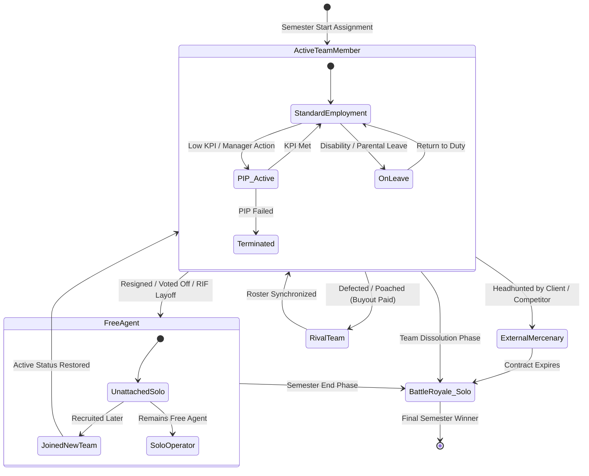

# Above-The-Fray
Simulation evaluation decision making software game

## Overview
Above-The-Fray is an interactive simulation and decision-making game platform built with JavaScript, HTML, and SQL. Designed for semester-long business school courses, the game simulates real-world corporate strategy, workplace politics, human capital management, and market competition.

## Tech Stack
* **Frontend:** HTML, CSS, JavaScript
* **Backend & Logic:** Node.js / JavaScript scripts
* **Database:** SQL
* **Intelligence Layer:** Gemini API

## How to Run
1. Clone the repository: `git clone https://github.com/72tefarie-art/Above-The-Fray.git`
2. Open `index.html` in your browser or run the JavaScript entry point file.

---

## High-Level System Architecture

---

## Semester Lifecycle & Application Logic

Over a 16-week business school course, student teams navigate corporate operations, workplace politics, HR interventions, alliances, betrayals, and an ultimate transition to individual competition.

### 1. Political, HR & Talent Mechanics (Sequence Flow)

This sequence diagram illustrates how the backend handles complex corporate operations including **M&A**, **RIFs/Layoffs**, **PIPs**, **Parental/Disability Leave**, **Defections**, **Poaching**, and **Whistleblowing**:

### 2. Corporate Mobility & Game State Progression

This state diagram maps player career mobility through performance plans, leave, poaching, defections, and the final transition into the individual Battle Royale:

